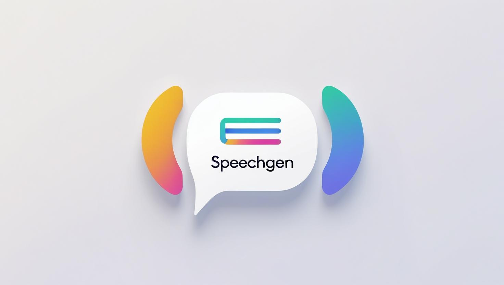

# 🎤 SpeechGen

### A Modern Text-to-Speech Desktop Application

*Convert your text into natural-sounding speech using Google Cloud Text-to-Speech API*

[](https://github.com/aquaimpact/CP3108B-TTS/releases)
[](https://github.com/aquaimpact/CP3108B-TTS/releases)



[📥 Download](#-download) • [🚀 Quick Start](#-quick-start) • [📖 Documentation](#-documentation)

---

## 📋 Table of Contents

- [✨ Features](#-features)
- [📥 Download](#-download)
- [⚡ Quick Start](#-quick-start)
- [🔧 Setup Guide](#-setup-guide)
- [📖 Usage Guide](#-usage-guide)
- [🛠️ Requirements](#️-requirements)
- [🐛 Troubleshooting](#-troubleshooting)

---

## 🖼️ Preview

<div align="center">

<p><em>SpeechGen's intuitive interface with tabbed navigation</em></p>
</div>

---

## ✨ Features

### 🎯 **Text-to-Speech Conversion**

<table>
<tr>
<td width="50%">

#### 🌍 **Language & Voice Selection**
-  **Smart Language Picker** - Dropdown selection from supported languages

- **Dynamic Voice Loading**  
  Voice options are automatically loaded based on your chosen language.

####  🎵 **Audio Customization**
- **Multiple Formats** - MP3, WAV, OGG output support
- **Speaking Rate Control** - Adjustable speech speed (0.25x - 4.0x)
- **Pitch Adjustment** - Fine-tune voice pitch (-20 to +20 semitones)
- **Audio Profiles** - Optimized settings for different use cases

</td>
<td width="50%">

####  📝 **Advanced Text Processing**
- **SSML Support** - Full Speech Synthesis Markup Language compatibility
- **Auto-Detection** - Automatically detects SSML vs plain text
- **Format Conversion** - One-click conversion between SSML and plain text
- **Syntax Validation** - Real-time SSML syntax checking

####  🎧 **Playback & Export**
- **Built-in Player** - Play and pause audio within the app
- **Custom Output Directory** - Save files to your preferred location

</td>
</tr>
</table>

### ⚙️ **Settings & Configuration**

<div align="center">

| Feature | Description | Status |
|---------|-------------|--------|
| 🔐 **Credential Management** | Easily upload your Google Cloud credentials `.json` file in a separate tab for better organization | ✅ |
| 🧪 **Connection Testing** | Verify your connection to Google's Text-to-Speech service with a built-in tester | ✅ |
| 💾 **Persistent Settings** | Save your credentials and preferences for future sessions | ✅ |
| 📁 **Default Directories** | Set default output locations | ✅ |

</div>

---

## 📥 Download

### Latest Release

<div align="center">

[](https://github.com/aquaimpact/CP3108B-TTS/releases/latest)

</div>

### All Releases
Visit the [Releases Page](https://github.com/aquaimpact/CP3108B-TTS/releases) for:
- 📦 Previous versions
- 📝 Release notes
- 🔍 Checksums for verification

---

## ⚡ Quick Start

### 1️⃣ **Install SpeechGen**
Download and install the latest version from the releases page.

### 2️⃣ **Setup Google Cloud**
Follow the [detailed setup guide](#-setup-guide) to configure Google Cloud TTS.

### 3️⃣ **Configure Credentials**
1. Open SpeechGen
2. Go to **Settings** tab
3. Upload your `credentials.json` file
4. Test the connection

### 4️⃣ **Start Converting**
1. Switch to **Text-to-Speech** tab
2. Select language and voice
3. Enter your text
4. Click **Convert**

---

## 🔧 Setup Guide

### 🌐 **Google Cloud Configuration**

#### Step 1: Enable Google Cloud TTS

<details>
<summary><b>📋 Detailed Instructions</b></summary>

1. Go to [Google Cloud Console](https://console.cloud.google.com)
2. Create a project if you havent already done so
3. Under the Quick access, click APIs & Services 
4. Enable APIs and Serices 
5. Search for Text to Speech API 
6. Enable it 
  ** You may have to setup billing account

</details>

#### Step 2: Create Service Account

<details>
<summary><b>🔑 Service Account Setup</b></summary>

1. Go to [Google Cloud Console](https://console.cloud.google.com)
2. Using the navigation menu on the left, click on APIs & Services > Credentials 
4. Select Create credentials > Service account 
5. Create Service account name

6. Under the Permissions section, select the Cloud Speech-to-Text Service Agent 
7. Click **Done**

</details>

#### Step 3: Generate Credentials File

<details>
<summary><b>📄 JSON Key Generation</b></summary>

1. Go into the service account you just created
2. Go to the Keys tab 
3. Create a new key  
4. Click JSON > Create
5. Select where you want to store this credentials file.

</details>

---

## 📖 Usage Guide

### 🔐 **Setting Up Credentials**

#### Method 1: Application Upload (Recommended)

<div align="center">

</div>

1. **Open Settings Tab**
   - Launch SpeechGen
   - Navigate to the **Settings** tab

2. **Upload Credentials**
   - Click **Browse** next to "Credentials File"
   - Select your downloaded `credentials.json` file
   - You should see: "TTS service initialized successfully!"

3. **Test Connection**
   - Click **Test Google TTS Connection**
   - Verify successful connection to Google's service

4. **Configure Preferences**
   - Enable "Remember settings between sessions"
   - Set default output directory
   - Click **Save Settings**

#### Method 2: Default Credentials (Advanced)

For developers or advanced users:

```bash
# Set up application default credentials
gcloud auth application-default login
```

**Credential locations:**
- **Linux/macOS:** `$HOME/.config/gcloud/application_default_credentials.json`
- **Windows:** `%APPDATA%\gcloud\application_default_credentials.json`

### 🎤 **Converting Text to Speech**

#### Step 1: Voice Configuration

<div align="center">

</div>

1. **Select Language**
   - Choose the language matching your text content
   - Available voices will automatically updated

2. **Choose Voice & Gender**
    - Select the right voice and the gender depending on use case

3. **Voice Type Information**
   - Voice type automatically detected
   - SSML availability indicated
   - Refer to [Google's TTS documentation](https://cloud.google.com/text-to-speech/docs/list-voices-and-types) for details

#### Step 2: Audio Configuration

<div align="center">

</div>

1. **Audio Format**
   - **MP3** - Compressed, smaller file size
   - **WAV** - Uncompressed, high quality
   - **OGG** - Open source, good compression

2. **Speech Parameters**
   - **Speaking Rate** - Adjust speech speed using slider
   - **Pitch** - Fine-tune voice pitch for optimal sound

3. **Audio Profile**
   - Select profile based on intended use:

#### Step 3: Text Input

<div align="center">

</div>

**Mode Detection:**
- **SSML Mode** - For supported voice types
- **Text Mode** - When SSML not supported

**SSML Features:**
```xml
<!-- Example SSML markup -->
<speak>
  Hello! 
  <break time="1s"/>
  This is <emphasis level="strong">important</emphasis>.
  <prosody rate="slow" pitch="low">Speaking slowly and low.</prosody>
</speak>
```

**Text Processing:**
- Automatic SSML/plain text detection
- One-click format conversion
- Real-time character count
- Syntax validation for SSML

#### Step 4: Output Configuration

1. **Set Output Location**
   - Click **Browse** to select save directory
   - Directory must be writable
   - Default directory can be set in Settings

2. **File Naming**
   - Enter custom filename
   - Extension automatically added based on format

3. **Convert & Play**
   - Click **Convert to Speech**
   - Use built-in player to preview
   - Audio file saved to specified location

---

## 🛠️ Requirements

### System Requirements

| Component | Requirement |
|-----------|-------------|
| **Operating System** | macOS 10.14+ |
| **Memory** | 4GB RAM minimum, 8GB recommended |
| **Storage** | 100MB free space |
| **Network** | Internet connection for Google Cloud API |

### Google Cloud Requirements

- **Google Cloud Project** with billing enabled
- **Text-to-Speech API** enabled
- **Service Account** with appropriate permissions
- **Valid credentials** JSON file

---

## 🐛 Troubleshooting

### Common Issues

<details>
<summary><b>🔐 Authentication Problems</b></summary>

**Issue:** "TTS service initialization failed"

**Solutions:**
1. Verify credentials file is valid JSON
2. Check service account has correct permissions
3. Ensure Text-to-Speech API is enabled
4. Confirm billing is set up (if required)

**Check permissions:**
\`\`\`bash
gcloud projects get-iam-policy YOUR_PROJECT_ID
\`\`\`

</details>

<details>
<summary><b>🌐 Connection Issues</b></summary>

**Issue:** "Connection test failed"

**Solutions:**
1. Check internet connection
2. Verify firewall settings
3. Test with different network
4. Check Google Cloud service status

**Test connection manually:**
\`\`\`bash
curl -H "Authorization: Bearer $(gcloud auth print-access-token)" \
  "https://texttospeech.googleapis.com/v1/voices"
\`\`\`

</details>

<details>
<summary><b>🎵 Audio Problems</b></summary>

**Issue:** "Cannot play generated audio"

**Solutions:**
1. Check audio file was created successfully
2. Verify file permissions
3. Try different audio format
4. Check system audio settings
5. Restart application

</details>

<details>
<summary><b>📝 SSML Issues</b></summary>

**Issue:** "SSML validation failed"

**Solutions:**
1. Check SSML syntax is correct
2. Verify voice supports SSML
3. Use built-in validation
4. Refer to [Google's SSML guide](https://cloud.google.com/text-to-speech/docs/ssml)

</details>

### Getting Help

1. **Check this README** for common solutions
2. **Review error messages** carefully
3. **Test with minimal examples** to isolate issues
4. **Check Google Cloud Console** for API quotas and billing
5. **Create an issue** on GitHub with:
   - Operating system version
   - Error messages
   - Steps to reproduce
   - Screenshots (if applicable)

---

### 🌟 Star this project if you find it helpful!

[](https://github.com/aquaimpact/CP3108B-TTS/stargazers)
[](https://github.com/aquaimpact/CP3108B-TTS/network/members)

**Made with ❤️**

[⬆ Back to Top](#-speechgen)

</div>
